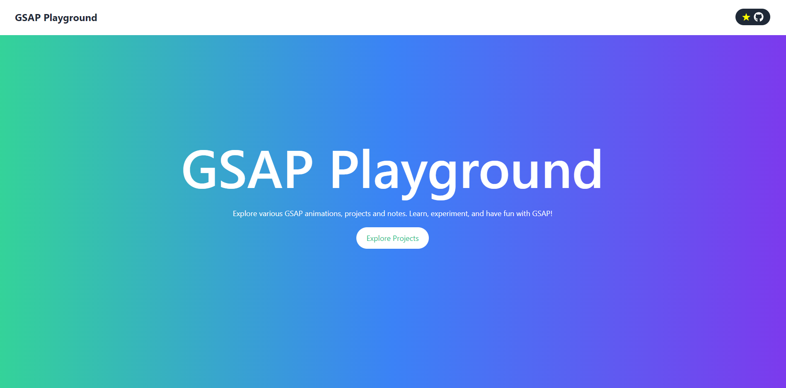

<div align="center">
<span><h1><a href="https://saqibbedar.github.io/Reactfolio/" target="_blank">GSAP Playground</a></h1></span>

<span>Unleash Your Creativity with GSAP! Dive into Amazing Projects!</span>

<div align="center">
    
  
   
  
</div>

</div>

</br>



## GSAP Playground 🎨

Welcome to the [**GSAP Playground**](https://saqibbedar.github.io/GSAP-Playground/), a comprehensive website showcasing various projects built using the GreenSock Animation Platform (GSAP). The website offers a user-friendly interface that allows developers to easily navigate between projects, view live demos, and access the source code of each project. Whether you're just starting with GSAP or you're an experienced developer looking to enhance your animation skills, this platform has something for everyone.

## Installation & setup 🛠️
If you'd still like to clone the repository and explore it locally, follow these steps:

1. **Clone this repository**:

    ```bash
    git clone https://github.com/saqibbedar/GSAP-Playground.git
    cd GSAP-Playground
    ```

2. **Open the projects locally** by navigating to the specific project directories.

## Contributions 😍

Feel free to contribute to this repository to make it an even more valuable resource for the community. Follow these steps to contribute:

1. **Fork this repository.**
2. **Clone your forked repository:**

    ```bash
    git clone https://github.com/your-username/GSAP-Playground.git
    ```

3. **Create a new branch for your changes:**

    ```bash
    git checkout -b feature/your-feature-name
    ```

4. **Make your changes and commit them:**

    ```bash
    git add .
    git commit -m "Add your message here"
    ```

5. **Push your changes to your forked repository:**

    ```bash
    git push origin feature/your-feature-name
    ```

6. **Create a pull request to the main repository.**

Visit the live site, explore, and feel free to contribute to the GSAP Playground!


# Support Project ❤️

This project is completely free under the [`MIT LICENSE`](./LICENSE). If you’ve found this project helpful and would like to support its development, you can consider buying me a coffee. Your support is greatly appreciated!

<div align="center">
<a href="https://www.buymeacoffee.com/saqibbedar"></a></div>